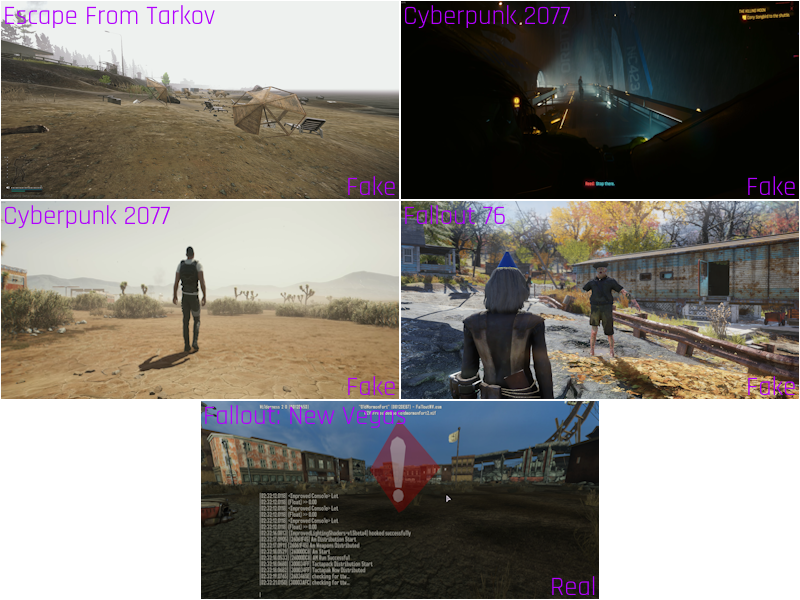

# Machine Learning Image Classification for Fallout: New Vegas Screenshots

This repository leverages a pre-trained VGG16 model (from TensorFlow) for image classification, with a focus on identifying screenshots from the game *Fallout: New Vegas - Tale of Two Wastelands*. Although initially set up for this specific game, the project is versatile and can be adapted to classify images based on any dataset provided by the user.

## Project Overview

The model in this project is based on VGG16, a well-known convolutional neural network trained on ImageNet data. Here, the top (classification) layer is removed to allow custom training on our own images. This setup enables the model to recognize and distinguish screenshots of *Fallout: New Vegas* from other images.

### Key Features
- **Transfer Learning**: The VGG16 model’s initial layers remain frozen, while custom layers are added to refine the model’s output.
- **Custom Training**: Trained with a dataset of *Fallout: New Vegas* screenshots, but easily adapted for any dataset.
- **Binary Classification**: The model classifies new images as either "real" (matches the training dataset) or "fake" (doesn’t match the dataset).

### Example Use Case
After training on the Fallout dataset, users can test their own images. The model then compares these images against the dataset, determining if they belong to *Fallout: New Vegas* or another source.

## Installation and Requirements

Ensure you have Python installed, then install dependencies with:

```bash
pip install -r requirements.txt
```

### Dependencies
- TensorFlow
- OpenCV
- NumPy
- (See `requirements.txt` for additional dependencies.)

## Data Structure

The dataset is structured as follows:

```
data/
├── fake/               # Folder for fake images to be resized and placed in processed
├── imagepredict/       # Folder for images to be predicted
├── ogimages/           # Original images (real screenshots)
├── processed/          # Folder for preprocessed images for training
├──── realpreprocessed/ # Folder for preprocessed real images
├──── fakepreprocessed/ # Folder for preprocessed fake images
└── real/               # Folder for real images to be resized and placed in processed

```

## Usage

### 1. Prepare the Data

Place your real screenshots in `data/ogimages/` and any additional images for comparison in `data/imagepredict/`.

### 2. Run the Training Script

Train the model by running the following command:

```bash
python main.py
```

The script will:
- Check for images in `data/ogimages/` and `data/imagepredict/`
- Preprocess images
- Train the model if no saved model is found
- Save the trained model as `trained_model.h5`
- Prediction using the trained model and images from `data/imagepredict/`
- Training skipped if no train images are found and trained model exists
- Option to predict only if images `data/ogimages/` and `trained_model.h5` exist

Each image is evaluated, and the output will state whether it is classified as "real" or "fake."



## Adapting the Model for Other Datasets

To classify images from another dataset:
1. Replace the images in `data/ogimages/` with your new dataset.
2. Run the training and prediction steps as described above.

## License

This project is open-source under the MIT License.
